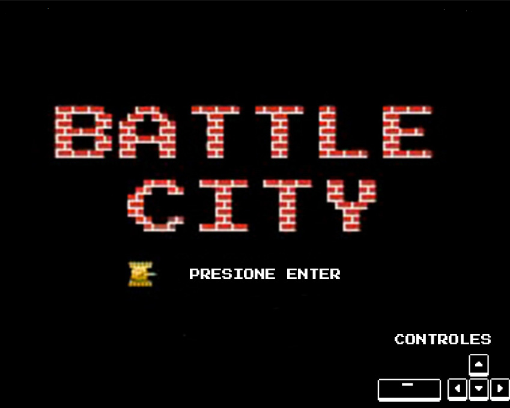
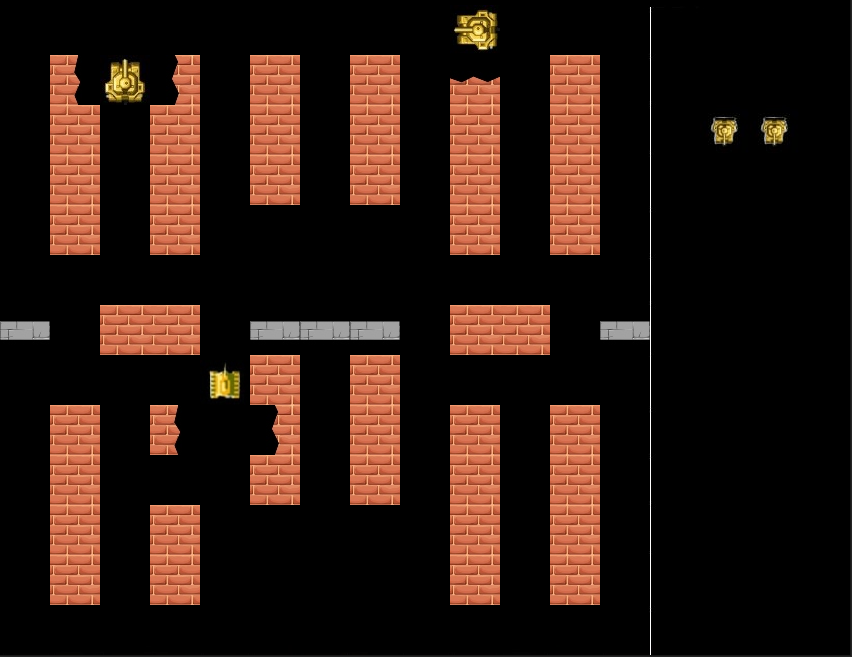

# Battle City

## Equipo de desarrollo

- Arias Luana
- Bazán Alex
- Bravo Álvaro
- Contreras Diego
- Franco Martín

## Capturas

## Reglas de Juego

controlando el tanque, debemos destruir los tanques de nuestros oponentes, sin permitirnos ser asesinados y sin permitirles alcanzar y derribar nuestro personaje.

## Instrucciones

Flechas direccionales : Movimiento del personaje
Espacio : Disparar

## Otros

- Programacion con Objetos 1 - Universidad Nacional de Hurlingham
- Versión de wollok
- Una vez terminado, no tenemos problemas en que el repositorio sea público
